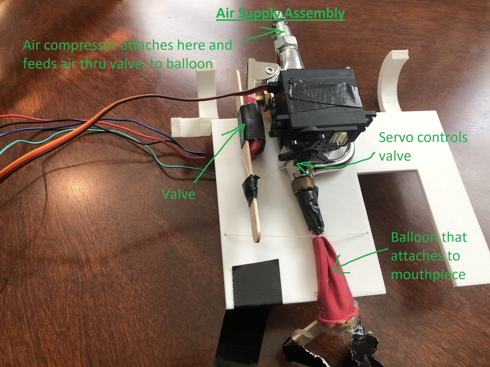

# Robotic Trombone
This reopository contains information about a self-playing trombone that I built.

This trombone is able to play songs autonomously. It features a slide that moves automatocally using a rack and pineon, an air supply controller that can turn the supply from an air compresson on and off using a servo, and a adjustable emrachure using a stepper motor and balloon.

> The [Build Video](https://www.youtube.com/watch?v=7OScdsAAHwE) outlines the idea behind the product, how the product works, the product's implementation, and a demonstration of the product.

**Table of Contents**
1. [Air Supply and Frequency Modifier Systems](Air-Supply-and-Frequency-Modifier-Systems)
2. [Slide System](Slide-System)
3. [Full Assembly](Full-Assembly)
4. [Changes and Improvements](Changes-and-Improvements)

## Air Supply and Frequency Modifier Systems

The Air Supply System is responsibe for providing the air from an air compressor to the trombone, and controlling the amount of air entering the trombone. The Air Frequency Modifier System is responsible for changing the angle between the balloon embrachure and mounthpiece in order to alter the pitch.

> 
> The valve is turned on and off using a servo motor. Turning the valve controls the amount of air travelling from the air compressor to the trombone, and can completely stop air flow if needed. The ballon at the end of the valve connects to the mouthpiece of the trombone and acts as the "mouth." The embrachure of this "mouth" is altered using the Air Frequency Modifier System.

> 
> Thread is attached to the meeting between the balloon and valve in the Air Supply System, and the other ends of this thread is wrapped around a wind-up. This wind-up is rotated using a stepper motor on the Air Frequency Modifier System. Rotating the wind-up changes the angle and embrachure of the balloon and can be used to play different notes.

## Slide System

The Slide System is responsible for moving the trombone's slide. Moving the slide allows the trombone to play different notes.

> 
> The rack gear is attached to an end of the slide. A pineon gear is attached outside of the slide. The pineon gear is rotated using a DC motor, and rotating this gear moves the slide.

## Full Assembly

The Air Supply System, Frequency Modifier System, and Slide System are combined to form the full assembly.

> 
> On top of the large 3D-printed plate is the Air Frequency Modifier System. Under this plate is the Air Supply System. The Slide System can be seen attached to the slide.

## Changes and Improvements

These are improvement's that I'd like to make in the future. The current version of the trombone doesn't implement these ideas.

1. *Dynamically change balloon angle / air frequency while playing song.* This isn't currently implemented because the stepper motor that controls the Air Frequency Modifier System is inaccurate.
2. *Increase style through tounging and other articulation.* This isn't currently implemented because the trombone must always start playing in 1st position for consistency reasons, and tounging would force airflow to start in different positions.
3. *Play entire songs in one go.* This isn't currently implemented because the air compressor has limited capacity and can't be on while song is playing, as compressor is very loud.